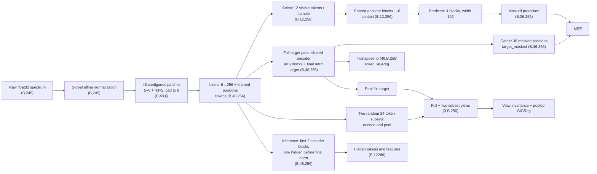

# SpectralFM-LeJEPA

SpectralFM learns frozen features from unlabeled 245-point spectra with masked joint-embedding prediction. A linear probe evaluates those features against raw spectra on eight labeled sets. Labels are excluded from pretraining; spectra from the evaluation corpus are eligible, so evaluation is transductive with respect to the input distribution.

## Architecture and data flow

The final recipe uses 48 contiguous patches and a six-block shared encoder. Training uses every encoder block; production inference uses the first two blocks and returns their raw token features before the final encoder normalization.



The two encoder paths in pretraining share weights. There is no EMA teacher or stop-gradient. The production output has **12,288 features** (`48 × 256`), not a pooled 256-dimensional vector.

| Stage | Shape | Operation |
|---|---|---|
| Input | `(B, 245)` | Raw `float32`; one spectrum is `(1, 245)` |
| Normalized | `(B, 245)` | Fixed global affine map `(x − μg) / σg` |
| Patches | `(B, 48, 6)` | Five width-6 patches and 43 width-5 patches; right-pad the latter with zero |
| Tokens | `(B, 48, 256)` | Shared `Linear(6 → 256)` plus learned positions |
| Context | `(B, 12, 256)` | 25% visible patches, passed through all six encoder blocks |
| Target | `(B, 48, 256)` | Full sequence through all six blocks and final LayerNorm |
| Prediction | `(B, 36, 256)` | Four-block predictor, width 192; loss applies only to masked positions |
| Pooled views | `(3, B, 256)` | Full target plus two encoded, pooled 24-token subsets |
| Production feature | `(B, 12288)` | First two encoder blocks, before final six-block LayerNorm; flatten token and feature axes |

## Training objective

For batch size `B = 256`, each token position is regularized across the batch:

```text
token loss = MSE(predicted, target_masked) + 0.05 × SIGReg(target transposed to (48, B, 256))
pooled loss = 0.95 × view invariance + 0.05 × SIGReg(pooled views)
total loss  = token loss + pooled loss
```

The training plan predeclares seed `101`, ten epochs (`497,990` steps), and expected source weights of 50/50 for regression-source spectra and the remaining packed corpus. These are sampling weights, not guaranteed per-batch proportions. Labels are never loaded by pretraining. The fixed global normalization statistics come from the packed-corpus metadata and are recorded in the run's `config.yaml`.

## Production inference

The export in [`outputs/final-model/production`](outputs/final-model/production) accepts raw `float32` spectra shaped `(B, 245)` and applies the training-time global affine normalization. It returns the flattened output after encoder blocks 1 and 2, before the final normalization used after block 6 during training. For one spectrum, the output shape is `(1, 12288)` (12,288 features).

The standalone SVG data-flow diagram can be generated with `scripts.architecture_diagram.render_dataflow()`; it has no external font, script, or asset dependencies.

## Commands

```bash
uv sync
systemd-run --user --unit=spectralfm-final-model-s101 bash -ic 'cd /mnt5/home/hadar/nova/SpectralFM-jepa && bash scripts/launch_final_model.sh'
```

The interactive login shell loads the user's W&B environment. The durable launcher runs training, export, evaluation, the predeclared gate, and report rebuild. For standalone export or evaluation, take the checkpoint path printed in `outputs/final-model/training.log`:

```bash
CHECKPOINT="$(sed -n 's/^final checkpoint: //p' outputs/final-model/training.log | tail -1)"
uv run python -m scripts.evaluate \
  --checkpoint "$CHECKPOINT" \
  --config configs/eval_final_model.yaml
uv run python -m scripts.export_production \
  --checkpoint "$CHECKPOINT" \
  --output outputs/final-model/production
```

The launcher uses [`configs/final_model.yaml`](configs/final_model.yaml). Evaluation uses [`configs/eval_final_model.yaml`](configs/eval_final_model.yaml). Pretraining and evaluation may require `WANDB_API_KEY`; keep the key in the shell environment, never in the repository.

## References

- Balestriero & LeCun (2025), [LeJEPA](https://arxiv.org/abs/2511.08544).
- Assran et al. (2023), I-JEPA, CVPR.
