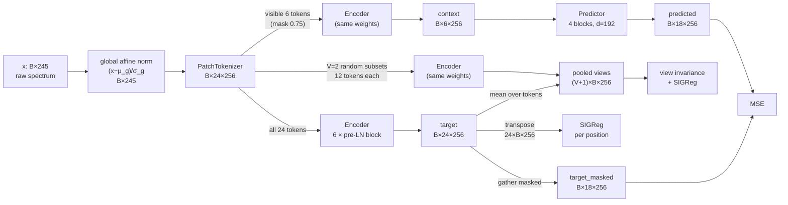

# SpectralFM-LeJEPA

A self-supervised foundation model for 245-point 1-D spectra. One encoder is pretrained with
LeJEPA on 12.76M unlabeled spectra, then frozen. Its embeddings are judged by linear-probe
regression of a physical parameter against the raw spectrum, on eight labeled sets.

## Problem

- **Data.** Spectra $x \in \mathbb{R}^{245}$ (float32), from simulation families:
  - single-channel: 9.1M spectra;
  - multi-channel: 3.4M;
  - small labeled-regression families: 0.15M;
  - other sources: 0.09M.

  Every component of a multi-component sample is its own spectrum. See
  [`docs/DATASETS.md`](docs/DATASETS.md).
- **Task.** Predict the scalar label `parameter_0` from a single spectrum. There are eight
  evaluation sets:

  | Set | n |
  |---|---:|
  | labeled_data | 4,716 |
  | 0055 | 25 |
  | 0106 | 64 |
  | 0109 | 96 |
  | 0112 | 68 |
  | 0113 | 70 |
  | 0114 | 230 |
  | 0120 | 125 |

- **Pretraining corpus.** It is all available spectra, including the evaluation spectra
  (approved by the data owner). Labels are never used.
- **Criterion.** The protocol:
  - nested cross-validation: 2 × 5 outer folds, 5 inner folds, seed 42;
  - per arm, a recipe chosen inside each fold from {none, standardize, PCA-whiten (full, 8, 32, 128)} × {RidgeCV, OLS}.
  - $\Delta R^2 = R^2_{\text{embedding}} - R^2_{\text{raw}}$, where both arms see the same rows and folds and the same fold-internal normalizers.
  - A set is **won** if $\Delta R^2 > 0$; **+0.05** is the target margin.
  - Goal: a single model that wins the majority (ideally all) of the eight sets.
- **Controls.** Every model is also compared with an untrained network of the same
  architecture and input normalization (the *random-init control*). This separates what
  pretraining learned from what the architecture and readout already provide.

## Why LeJEPA

Labels are scarce (25–4,716 per set) and unlabeled spectra are plentiful, so the representation
must come from self-supervision, and it must suit a **linear probe on very few samples**.

- **Predict in latent space, not input space.** Joint-embedding predictive architectures
  (I-JEPA, Assran et al. 2023) predict the representation of masked regions from visible
  ones. Unlike reconstruction objectives, they spend no capacity modelling unpredictable
  input detail, so the encoder is pushed toward the structure that determines the spectrum
  globally, such as the simulation parameters.
- **Collapse prevention without heuristics.** LeJEPA (Balestriero & LeCun 2025,
  arXiv:2511.08544) replaces the usual EMA teacher, stop-gradient and centering
  with one regularizer, **SIGReg**, which pushes the embedding distribution toward an isotropic
  Gaussian $\mathcal{N}(0, I)$.
  - Their analysis shows that the isotropic Gaussian minimizes the worst-case downstream risk
    of linear probes. That is exactly how this model is used: a ridge/OLS probe on 25–230 samples.
  - SIGReg is a sliced Epps–Pulley test, applied to the 1-D projections of the embeddings
    on random directions. By Cramér–Wold, matching every 1-D projection matches the joint
    distribution.
  - Its cost is linear in batch size and dimension.
  - It has a single trade-off weight λ.
- **One shared encoder.** Context and target use the same weights; no teacher copy is kept.
  That halves memory and removes the EMA schedule as a hyperparameter.

## Model

### Data flow (pretraining)



The shapes below assume the defaults: B = 256, 24 patches, d = 256, mask ratio 0.75.

| Tensor | Shape | Definition |
|---|---|---|
| `x` | B × 245 | spectrum after global affine normalization |
| `patches` | B × 24 × 11 | contiguous patches, zero-padded to width 11 |
| `tokens` | B × 24 × 256 | `Linear(11→256)(patches) + pos_embed[24×256]` |
| `visible_idx` / `masked_idx` | B × 6 / B × 18 | random per sample (6 = 24 × (1 − 0.75)) |
| `context` | B × 6 × 256 | `Encoder(tokens[visible_idx])` |
| `target` | B × 24 × 256 | `Encoder(tokens)`; output of the final LayerNorm |
| `predicted` | B × 18 × 256 | `Predictor(context, visible_idx, masked_idx)` |
| `views` | 3 × B × 256 | `mean_t target`, plus 2 pooled encodings of random 12-token subsets |

### Objective

$$
\mathcal{L} \;=\; \underbrace{\mathrm{MSE}\big(\hat z_{\text{mask}},\, z_{\text{mask}}\big) + \lambda\,\overline{\mathrm{SIGReg}}_{p=1..24}\big(z_{:,p,:}\big)}_{\text{token-level JEPA}}
\;+\; \beta\Big[(1-\lambda)\,\operatorname{mean}_{v,b,d}\big(\bar z_v - \operatorname{mean}_{v'}\bar z_{v'}\big)^2 \;+\; \lambda\,\overline{\mathrm{SIGReg}}_v(\bar z_v)\Big]
$$

- **Token-level term.**
  - The prediction error is computed only at the masked positions.
  - SIGReg tests each of the 24 positions across the B samples of the batch (N = B), then averages.
  - λ = 0.05. SIGReg's value is about 1 even for a perfect Gaussian, so λ = 0.05 matches the paper's 0.95/0.05 balance.
  - Settings: `lightly.loss.SIGReg`, 17 knots, t_max = 3, 1,024 random slices, computed in fp32.
- **Sample-level term** (β = 1). This is LeJEPA's multi-view form.
  - The pooled embeddings $\bar z_v$ of the full spectrum and of V = 2 random half-subsets of
    the patches must agree, and they are regularized toward $\mathcal{N}(0, I)$.
  - It gives the pooled representation a direct sample-level training signal; the token-level
    term trains positions only.
- **No EMA, no stop-gradient.** Gradients flow through both the context path and the target path.

### Tokenizer

- **Patches.** 245 = 24 × 10 + 5, so `np.array_split` gives **5 patches of 11 samples**
  (indices 0–54) followed by **19 patches of 10** (55–244).
  - The patches are contiguous and don't overlap.
  - Every sample belongs to exactly one patch, so masking a patch hides exactly its samples.
- **Embedding.** Each 10-sample patch is right-padded with one zero to width 11. One shared
  `Linear(11 → 256)` embeds all patches.
- **Positions.** A learned positional embedding (24 × 256, truncated-normal σ = 0.02) is added.
- **Resolution.** About 10 samples per token; `model.num_patches` changes it, and 12 and 48
  patches are under test.

### Transformer

| | Encoder | Predictor |
|---|---|---|
| Blocks | 6 | 4 |
| Width d | 256 | 192 (`Linear(256→192)` in, `Linear(192→256)` out) |
| Heads | 8 (head dim 32) | 6 (head dim 32) |
| MLP | 256 → 1024 → 256, GELU | 192 → 768 → 192, GELU |
| Norm | pre-LN in each block, plus a final LayerNorm | pre-LN, plus a final LayerNorm |
| Positions | from the tokenizer | its own 24 × 192, plus a learned mask token at each masked position |
| Parameters | 4.74M | 1.88M |

- Blocks are `nn.TransformerEncoderLayer(norm_first=True, batch_first=True)`, with dropout 0
  and full bidirectional self-attention.
- The encoder accepts any subset of tokens, so the context, target and view passes share weights.
- Total: **6.63M parameters**, of which the tokenizer has 9.2k.

### Input normalization

`global`: $(x - \mu_g)/\sigma_g$, where $\mu_g$ = 0.3784 and $\sigma_g$ = 0.5126 are fixed
scalars computed over all 12.76M spectra.

- The map is affine and the same for every spectrum, so each spectrum's amplitude and offset
  are preserved. The raw baseline sees the same information.
- Per-sample z-scoring was tried and rejected: it removes amplitude, which carries most of
  the label signal on the small sets (on 0055, raw R² drops from 0.59 to 0.18).

### Training

- **Optimizer.** AdamW: learning rate 5e-4, weight decay 0.05, batch 256. Linear warmup over
  10% of the steps, then cosine decay to 1e-3 × the peak. fp16 autocast; the regularizers run in fp32.
- **Data.** Read from a single packed float32 memmap holding all 12,758,642 spectra.
- **Mix.** Each batch draws 50% from the 14 labeled-regression families, which hold 1.2% of
  the spectra, and 50% from everything else.

## Evaluation

- **Frozen encoder outputs.** `hidden_states` = (token embeddings, blocks 1–5, final
  LayerNorm), indexed layer0–layer6, each of shape B × 24 × 256.
- **Readouts per layer:**
  - `mean`: average over tokens, 256 dimensions;
  - `seg4`: means of 4 contiguous token segments, 1,024 dimensions;
  - `flat`: all tokens concatenated, 6,144 dimensions, for layers 0–2 only.
- **Arm selection.** Inner CV selects the arm (layer × readout) and recipe; the raw arm uses
  the same recipes.
- **Probe backend.** It is a float64 PyTorch port of the scikit-learn probe (PCA whitening,
  RidgeCV leave-one-out, OLS) that runs on the GPU. On six real sets it matches scikit-learn
  to |ΔR²| ≤ 2e-5, with no differences in which recipe each fold picks; labeled_data takes
  about 20 min instead of hours.

## Status (2026-10-07)

The best model so far is 3 epochs, global term plus the 50% labeled-regression mix
(`configs/screen6.yaml`, `long_g1_lr50`):

| | labeled_data | 0055 | 0106 | 0109 | 0112 | 0113 | 0114 | 0120 | Wins |
|---|---:|---:|---:|---:|---:|---:|---:|---:|---:|
| raw R² | 0.830 | 0.591 | 0.697 | 0.918 | 0.377 | 0.548 | 0.983 | 0.380 | |
| model R² | 0.962 | 0.707 | 0.593 | 0.892 | 0.686 | 0.562 | 0.985 | 0.301 | **5/8** |
| random-init R² | 0.945 | 0.463 | 0.677 | 0.944 | 0.368 | 0.566 | 0.983 | 0.331 | 4/8 |

- **The small sets (n = 25–125) are dominated by noise.** Two seeds of one recipe can differ
  by more than 0.1 in R² on a single set, so conclusions rest only on patterns that repeat
  across runs.
- **Running:** a 10-epoch run (`configs/long1.yaml`) with two seeds, plus a tokenizer-resolution
  screen (`configs/screen7.yaml`).
- **Experiment history:** `docs/superpowers/specs/`, and the W&B project `spectralfm-lejepa`
  (metrics and figures only).

## Usage

```bash
uv sync
uv run pytest                                                    # fast tests
uv run python scripts/pretrain.py data.source=packed data.normalization=global ...
uv run python -m scripts.evaluate --checkpoint outputs/<run>/checkpoint_last.pt --config configs/eval.yaml
uv run python -m scripts.screen --config configs/screen6.yaml --gpus 0,1,2,3
```

- `WANDB_API_KEY` must be set in the shell environment. It never goes in the repository.
- Any config value can be overridden as `section.key=value`.

## References

- Balestriero & LeCun (2025). *LeJEPA: Provable and Scalable Self-Supervised Learning Without the Heuristics.* arXiv:2511.08544.
- Assran et al. (2023). *Self-Supervised Learning from Images with a Joint-Embedding Predictive Architecture* (I-JEPA). CVPR.
- Baevski et al. (2022). *data2vec: A General Framework for Self-supervised Learning in Speech, Vision and Language.* ICML.
- Wu, Balestriero & Levine (2026). *VISReg: Variance-Invariance-Sketching Regularization for JEPA training.* arXiv:2606.02572. It was tested here and gave no gain over SIGReg.
